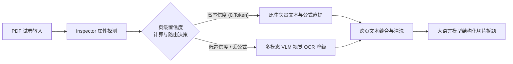
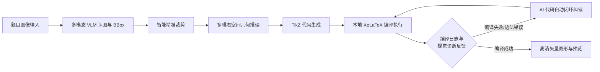

# 小陈的数学宝藏

[中文](README.md) | [English](README_EN.md)


> **项目标签**：数学题库 | 高中数学 | 备课教研 | A4 仿真排版 | 智能组卷 | 高考级导出 | OCR 识图 | DeepSeek AI | 教育技术
>
> ⚠️ **派生声明**：本项目是基于 [`JudgePeach/math-question-bank`](https://github.com/JudgePeach/math-question-bank) 的**修改派生版**，采用与原项目相同的 **GNU AGPLv3** 协议。详见下方「[项目渊源与致谢](#项目渊源与致谢)」。

**小陈的数学宝藏** 是一个专为中学数学教师打造的、完全运行在您自己电脑上的轻量级半自动化数学题库与组卷备课工作台。它在原项目（MathBank）核心架构之上，面向"个人备课"场景做了二次开发：明确的**题库工作台 / 组卷工作台**双入口、受控词表防标签混乱、难度枚举统一、拆卷进度可视化等。

无需复杂的前端编译即可运行：Windows 便携包内置 Python，解压后即可启动；macOS 便携包不内置 Python，运行前请确认本机已安装 Python 3.10 或更高版本，启动器会自动检测并创建或修复项目隔离的 `venv`。支持数学公式与几何图形秒级预览，深度集成一键组卷、A4 仿真画布排版、高考级 PDF 试卷导出、DeepSeek AI 解题以及一键 OCR 题目识别。


---

## 📖 项目渊源与致谢（Provenance & Attribution）

本项目是开源项目 **[`JudgePeach/math-question-bank`](https://github.com/JudgePeach/math-question-bank)**（原项目名 MathBank）的**派生修改版**：

- **原作者**：[JudgePeach](https://github.com/JudgePeach)，感谢其开源贡献，本项目的全部底层能力（FastAPI 服务、PDF/Word/LaTeX 智能拆卷、A4 仿真排版、AI Agent 工作流等）均源自该仓库。
- **原项目协议**：[GNU AGPLv3](https://www.gnu.org/licenses/agpl-3.0.html)。
- **本派生项目协议**：**同样采用 GNU AGPLv3**，并保留原版权声明与许可证文件。根据 AGPLv3 要求，任何分发（含通过网络提供服务）都必须向用户提供完整的对应源代码——本仓库即满足该要求。
- **与原项目的关系**：本仓库在保留原项目核心架构与许可证的前提下，进行了面向"个人备课"的二次开发（详见下方「[相比原项目的变动](#相比原项目的变动)」）。原项目的后续更新可通过 `upstream` 远程跟踪。

> 原项目地址：<https://github.com/JudgePeach/math-question-bank>

---

## ✨ 相比原项目的变动

下列能力为**本派生版新增或修改**（其余功能继承自原项目 `JudgePeach/math-question-bank`，详见下文各章节）。本表基于 `git diff origin/main` 完整核对，覆盖自上游派生以来的全部本地提交，而非仅记录近期改动：

- 🏷️ **品牌与定位重命名**：由 MathBank 更名为「小陈的数学宝藏」，明确为个人备课工具，界面区分**题库工作台 / 组卷工作台**双入口。

### 📥 导入与拆解

- 🗂️ **多文件队列批量导入（核心新增）**：可一次性将多份 PDF / Word / TeX 试卷加入拆解队列，后端逐份串行拆解、前端按「来源文件」分组展示并支持人工逐份审核；配套「已导入文档免重复拆解」「拆解结果审查筛选（未导入 / 已导入 / 全部）」「审查目录竖栏标签（文件序号 + 题型缩写 + 文件内连续序号）」「队列卡死自愈 + 部分完成即可导入」等健壮性增强。配图支持批量上传与去重。
- 🧩 **文档分块拆题 + 单题 OCR 自动分流（新增）**：新增 `paper_chunking.py` 按题号边界切分超长文档、逐块解析再合并去重，根治「超长文档超 `max_tokens` 截断」；长文档自动分块并对单题智能选择 OCR 通道。
- 🤖 **OCR 后自动全量分类（新增）**：OCR 识别后由 AI 自动全量填充 8 个分类字段并覆盖式写入，免去手动保存弹窗。
- 🔍 **原卷预览放大（新增）**：拆解页「查看原文件」升级为 250 DPI 真实像素基准，缩放范围放宽至 0.2–5.0，便于逐题核对题图。
- 🧹 **导入题号 / 出处清洗（修改）**：所有入库路径（导入与手动录入）均防御性剥离题干最开头的残留原卷顺序题号（避免与系统编号叠加），`source` 默认填为来源文件名便于溯源。
- 📊 **拆卷步骤进度条 + 错误定位（新增）**：AI 拆卷过程进度可视化，可见进行到哪一步；出错时高亮失败步骤，便于定位问题卷。

### 🏷️ 标签与难度治理

- 🧩 **受控词表防标签混乱（核心新增）**：新增 `mathbank/resources/tag_vocabulary.json` 受控词表（知识点 422 规范名 + 64 别名，解题方法 70 + 7 别名），并新增 `normalize_tag_list(raw, field)` 在**所有写入路径**（单题录入 / 编辑 / AI 分类 / PDF 批量导入）落库即归一——AI 或手动产生的旧写法（如 `函数的单调性`）自动折叠为规范名（`函数单调性`），从源头杜绝标签碎片化。
- 🎚️ **难度枚举统一（核心修复）**：原项目难度词表在提示词、校验、数据库默认、前端计数四处互不相容（且存在幽灵值 `medium`）。本版抽出 `DIFFICULTY_VALUES` 作为全链路唯一事实来源（四档：易错 `easy_error` / 常规 `normal` / 挑战 `challenge` / 强基 `qiangji`），并新增 `normalize_difficulty()`，AI 链路不再把常规题误判为易错。
- 🏷️ **题目多标签（知识点 + 解题方法）与题库多选筛选（核心新增）**：新增 `knowledge_list` / `solve_method` 两列（逗号分隔多值 + 索引），AI 自动打标 + 手动修正；题库新增知识点 / 解题方法「搜索式多选」筛选与来源筛选。
- 🔗 **关联章节多章节归属（新增）**：支持一道题（含融合题）归属多个章节，录入 / 导入 / AI 分类 UI 均已支持。

### 💰 AI 成本优化

- 🆓 **免费模型自动路由（新增模块 `free_model_routing.py`）**：先用免费模型评估文档拆解难度（基于 LaTeX 源码信号，PDF / LaTeX 双链路统一），简单 / 中等走免费、困难 / 超长 / Key 缺失 / 异常时安全回退付费；含长度感知短路与超时回退，省钱不降质。

### 📐 组卷工作台

- 🎯 **组卷工作台备课场景增强（核心新增，`paper.js` 大规模重写 +974 行）**：围绕「选题 → 组卷 → 体检 → 保存 → 导出」备课流程做系统性增强，含「全部试题」定高虚拟滚动、题目答案弹窗（异步加载答案 + 一键加入试卷）、行内公式渲染修复、批量加入试卷等（详见提交 `e252f6e` 与 `7ab4ad7`）。

### 🔒 公式、文档与导出

- 🔒 **公式锁协议（MBM）强化与放宽并行**：批量导入 / 导出锁定公式原位不丢不串；同时放宽 `restore(strict=False)` 提升容错，并在提示词中加强公式锁定协议约束。
- 📄 **docx 拆卷增强（修改）**：docx → PDF → 页图管线升级至 250 DPI；新增 MathType 乱码清洗与检测。
- 📝 **Word 导出优化（修改）**：解析图 PNG 兜底去边框 + 等比，避免误入学生版试卷。

### 🎨 前端体验与稳定性

- 🎨 **前端视觉优化（新增）**：主题色系统整体换血为珊瑚橘（默认）/ 靛青 / 青碧 / 洋红 / 藏青 / 天空 6 套；品牌 Logo 替换为手绘「橙子 + 羽毛球 + 数学」；favicon 全套替换并以 data URI 内联绕过 Safari 顽固缓存；浅色模式对比度、卡片 hover 上浮、聚焦环等玻璃拟态精修。（一些小心思hhh）
- 🔣 **选择题选项归一化（新增）**：新增 `latex_normalize.py` 将 `A. B. C. D.` 行内选项统一规整为 exam-zh `choices` 环境，且幂等可重复调用，不破坏既解答题 / 填空题。
- 🧰 **TikZ 入口隐藏（修改）**：前端移除易误触的 TikZ 绘图入口（后端保留并做空值保护）。（此处主要是因为针对图片希望直接采取截图的方式放进去，有的时候会忘记勾选这个选项，所以解析出来反而增加了工作量，此处如需用到可以再参考一下源码题库效果）
- 🐞 **多项体验 bug 修复**：保存后点「录入单题」误弹未保存提示；组卷已选试题 tab 切换后空白；编辑面板解题方法 / 知识点标签串到所有题目；多文件队列嵌套作用域卡死与有害入队拦截；favicon 标签页顽固缓存等。

### 🧪 测试与工具

- ✅ 新增 `tests/` 回归用例与 `tools/` 轻量验证脚本（难度词表、受控词表、多文件队列、关联章节、OCR 自动分类、免费路由、虚拟滚动、保存提示等 jsdom / pytest 回归），覆盖本次派生的核心改动。

### 已知 TODO / 路线图

以下为**尚未实现**或**待完善**的部分，欢迎贡献：

- 📝 **讲义（handout）功能**：从"题库 / 组卷"走向"备课"最关键的一块，目前**规划中、未实现**。
- 💡 **受控词表前端联想（第 3 层）与周期复检工具**：当前归一在后端生效，前端标签输入框仍为自由文本；计划后续增加"只选已有"的联想下拉与 `tools/tag_audit.py` 周期复检，让词表越养越准。

---

## 🎯 核心亮点

只需了解一些基础的 LaTeX 数学公式语法，小陈的数学宝藏就能帮一线数学老师高效解决组卷与备课难题：

- 🎨 **1:1 A4 仿真组卷排版**：提供像 Word 一样直观的仿真试卷画布，密封线、大标题、注意事项框一应俱全。支持拖拽排序、题目留白高度调整，以及一键切换 A3 答题卡与高考 19 题预设。
- ⚡ **秒级公式渲染与高考级导出**：内置专业数学公式排版引擎，网页上修改秒级实时预览。支持一键导出高考标准的高清 PDF 试卷与完整的排版源码包。
- 🤖 **AI 智能组卷与辅助解答**：内置 DeepSeek 等大语言模型，能根据考点细目表与难度阶梯一键自动挑选题目生成试卷；支持单题一键 AI 生成详细解析与教学反思。
- 📚 **主流教材大纲一键切换**：原生预设 **人教A版**、**人教B版**、**苏教版**与**沪教版**标准高中大纲目录，切换大纲时系统自动智能映射，无需手动重新整理题目。
- 📄 **多格式试卷智能拆解与 PDF 双策略分流**：支持直接拖入 **LaTeX 源码 (.tex)**、**PDF 试卷 (.pdf)** 或 **Word 试卷 (.docx)** 快速智能切片拆题。PDF 拆解原生提供 **【原生文字公式提取】（默认推荐）** 与 **【全图视觉 OCR】** 双解析策略：推荐优先使用原生提取模式，享受 `PDF Inspector` 毫秒级 0 视觉 Token 损耗的极速提取，当遇到 Word/MathType 特殊导出卷导致公式硬转化为图片时，系统会自动平滑降级并触发 VLM 视觉 OCR 识图补全；同时，为避免极少数排版极其特殊的试卷使自愈规则失效，系统亦保留了全图视觉 OCR 的强力备选通道，保障 100% 拆解成功率。Word 导入则会结构化转换 Office OMML，并从 OLE `Equation Native` 流解析 MathType 结构，不能高置信转换的公式保留原预览图并标记人工核对。
- 🗂️ **多份试卷队列式批量拆解**：可一次性将多份 PDF / Word / TeX 试卷加入拆解队列，按来源文件分组、逐份串行拆解并支持人工审核，告别反复单份操作。
- 🆓 **免费 / 付费模型自动路由**：先用免费模型评估文档拆解难度，简单题走免费、复杂 / 超长 / 异常自动回退付费，显著节省 API 开销且不降质。

---

## 🤖 AI Agent / Harness 工作流

系统内置了多套高度自动化、容错与自愈的 AI Agent / Harness 工作流，保障试卷拆解、几何绘图与并发解题的高可靠性：

### 1. PDF 试卷智能解析 (PDF Parsing Harness)



### 2. 几何图形重构与闭环自愈 (Geometry Reconstruction Harness)



### 3. 试卷切片与并发解题管道 (Paper Ingestion Harness)


---

## 📝 使用前提与环境说明

- **LaTeX 本地编译环境依赖**：只有当您需要使用 **TikZ 几何图形重绘** 或 **一键导出高清 PDF 试卷** 这两项功能时，系统才需要调用本地的 LaTeX 编译工具链。如果您仅进行题目录入、公式预览、题库检索、AI 智能解答与排版源码导出，**完全不需要安装 LaTeX**。若需使用上述两项功能，建议您在本地安装：
  - **macOS 用户**：推荐安装 [**MacTeX 官网**](https://www.tug.org/mactex/)（安装包约 5GB，国内推荐使用 [清华大学镜像站](https://mirrors.tuna.tsinghua.edu.cn/CTAN/systems/mac/mactex/) 极速下载）
  - **Windows 用户**：推荐安装 [**TeX Live 官网**](https://www.tug.org/texlive/)（ISO 镜像约 5GB，国内推荐使用 [清华大学镜像站](https://mirrors.tuna.tsinghua.edu.cn/CTAN/systems/texlive/Images/) 极速下载；也可选择 MiKTeX）
- **📄 Word (.docx) 试卷安全导入**：无需安装 Microsoft Word 或 MathType。系统可转换常见 OMML 公式，并使用 `olefile` + MTEF v5 记录树解析 MathType 结构；普通 `32`、拉丁 `p` 等不会再因旧的字符规则被误判。系统还会递归保留超链接/修订文字/Symbol 字符并提取表格与原图，不能高置信转换的公式则保留 Word 预览图。拆卷报告会分别显示结构转换、内嵌 LaTeX、有限兼容及人工核对数量。

---

## 🚀 快速开始

### 📦 方式一：下载便携包（非技术/小白用户首选）

如果您不熟悉命令行或 Python 环境，可以使用项目内置的发布构建工具 `python3 -m scripts.build_release` 生成对应系统的便携包（构建器会校验固定 SHA-256 的运行时、Release 白名单与源码 smoke）。Windows 包内含完整 Python 3.10 运行时；macOS 包不内置 Python，运行前请确认本机已安装 Python 3.10+。

两个启动器只会停止由当前项目记录且身份校验通过的旧服务；若端口 8000 被其他程序占用，会安全退出。服务健康检查失败时不会打开浏览器。

---

### 💻 方式二：源码运行

1. **获取项目**（推荐先 Fork 原项目到自己的账号，再克隆自己的 Fork）：
   ```bash
   # 方式 A：克隆你自己的 Fork
   git clone <你的仓库地址>
   cd math-question-bank
   # 可选：跟踪上游原项目，方便后续同步更新
   git remote add upstream https://github.com/JudgePeach/math-question-bank.git

   # 方式 B：直接克隆原项目后再自行修改
   # git clone https://github.com/JudgePeach/math-question-bank.git
   ```
2. **安装依赖**（要求 Python 3.10+）：
   ```bash
   python -m pip install -r requirements.txt
   ```
   参与开发或运行测试时，改用 `python -m pip install -r requirements-dev.txt`。依赖版本已锁定，升级时请同步运行测试与 `python -m pip check`。
3. **启动项目**：
   - **Mac 用户**：双击 **`启动题库系统.command`**
   - **Windows 用户**：双击 **`启动题库系统.bat`**
   - **命令行启动**：运行 `python -m uvicorn main:app --reload`，浏览器访问 `http://127.0.0.1:8000`

> [!TIP]  
> **PDF & Word 试卷智能拆解建议**：
>
> 1. **PDF 策略选型**：导入 PDF 试卷时，建议保持默认选中&#x7684;**【原生文字公式提取】**&#x6A21;式，享受毫秒级 0 视觉 Token 损耗极速切片；若遇到图片公式导致丢公式系统会自动触发 VLM OCR 补全；遇排版极其特殊的扫描卷可手动切换&#x4E3A;**【全图视觉 OCR】**&#x6A21;式。
> 2. **试卷内容建议（避免超出 Token 限制）**：无论导入 **PDF 试卷** 还是 **Word (.docx) 试卷**，为防止试卷过长超出大模型单次 Context Window / Token 窗口上限，强烈建议优先选用**仅含题干（无冗长详细解析）**&#x7684;试卷进行切片拆分。

---

## 🔑 API 配置与大模型选型指南

无论是使用源码还是便携包，AI 智能解析与 OCR 公式识别均依赖外部 API。启动项目后，点击网页右上角的 **设置（齿轮）按钮** 即可一键填入并保存密钥：

### 1. 🤖 纯文本 AI 推理大模型（解题/拆卷/分类）

推荐直接使用 [DeepSeek 官方开放平台](https://platform.deepseek.com/) 密钥，性价比与逻辑推导极高。

### 2. 📷 默认公式识图模型（OCR - 必须使用多模态 VLM 大模型）

- **必须使用多模态大模型**：公式识图需要读取图像，因此 **DeepSeek 纯语言模型无法用于 OCR 识图**。
- **国内模型选型**：推荐使用 **通义千问 (Qwen-VL)** 或 **MIMO** 系列。例如通过 [硅基流动 (SiliconFlow) 专属链接](https://cloud.siliconflow.cn/i/hkgjSWrg) 注册并完成实名认证后，可直接获得 **16 元代金券** 试用赠额；或者前往 [阿里云百炼平台](https://bailian.console.aliyun.com/) 注册，旗下的多模态模型在 **3 个月内均提供免费试用额度**。硅基流动可使用 `Qwen/Qwen3-VL-8B-Instruct`；阿里百炼常规 OCR、拆卷和分类推荐 `qwen3.7-flash`，解答与绘图推荐 `qwen3.7-plus`。
- **海外/中转站模型**：如果有合适的中转站或者其他渠道，**强烈推荐选择 `GPT-5.6 Luna`**！GPT 5.6 Luna 最近大幅降价，不仅在公式提取与精度上远超大多数模型，**使用成本甚至比千问还要便宜**，是识图的首选。

### 3. 🎨 TikZ 几何绘图模型（`PREFER_DRAW_MODEL`）

- 如果开启了双阶段多模态几何插图重绘，**建议不要使用国内模型**（目前国内模型在 TikZ 几何代码生成上表现普遍较差）。
- 建议选择 **GPT 系列**（如 `GPT-5.6 Luna`）或 **Gemini 系列**（如 `Gemini 3.6 Flash`），绘图精准度与矢量还原度极高。

> [!WARNING]  
> **关于第三方 API 中转站的风险与担保声明**
>
> 下面提供的两个中转站链接**仅因为开发者个人日常在用，不对其服务稳定性、模型真实度（是否存在掺水/以次充好）或数据隐私安全性提供任何形式的担保**。第三方中转站可能存在数据泄露、隐私风险或模型替换行为，请用户务必谨慎评估与使用：
>
> - **推荐多模态中转站 A (适合 GPT 模型)**：通过专属 [RightCodes 注册链接](https://www.rightapi.ai/register?aff=f7656b31) 获取 API Key，提供价格实惠且性能优越的 `gpt-5.6-luna` 系列。
> - **推荐多模态中转站 B (适合 Claude / 阿里系模型)**：通过专属 [PackyAPI 注册链接](https://www.packyapi.com/register?aff=5yyF) 获取 API Key，适合 Claude及阿里百炼模型。

> [!IMPORTANT]  
> **关于 TikZ 自动几何重绘与本地 LaTeX 编译环境依赖**
>
> 系统的 AI 智能几何插图 TikZ 重绘和 PDF 试卷编译渲染功能，高度依赖您**本地已安装的 LaTeX 编译排版环境**（如 macOS 下的 **MacTeX**，Windows 下的 **TeX Live** 或 **MiKTeX**）。  
> 请确保安装后，您本地的命令行中能正常调用 `pdflatex` 与 `xelatex` 命令（即已正确将 LaTeX 工具链加入系统的环境变量 `PATH`）。如果本地未安装，AI 生成的 TikZ 源码和试卷 LaTeX 源码依旧能够完好保存与导出，但后台编译 PDF 将受到限制。

---

## 🔄 版本升级与数据备份

### 升级方式

- **✨ 界面一键检查更新与便携包直链**：系统内置自动版本检测机制。进入网页右上角【设置】$\rightarrow$【版本更新】，即可一键实时比对 GitHub Release，查阅最新版本特性并一键下载对应系统的便携包；亦支持一键忽略不常更新的版本。
- **方式 A：Git 升级（源码用户推荐）**
  ```bash
  git pull
  ```
  *说明：数据库 (`*.db`)、API 密钥 (`.env`)、维度配置 (`data_backup/`) 及插图 (`static/uploads/`) 均已被 Git 忽略，执行 `git pull` 绝不会影响本地数据。*
- **方式 B：便携包覆盖更新**
  1. 先创建一份可验证完整备份（见下方"完整备份与恢复"）。
  2. 在网页右上角点击电源按钮安全关闭题库，等待页面提示服务已停止；不要在后台运行时覆盖。
  3. 把新版 ZIP **解压到一个临时新目录**，不要直接解压进原目录。
  4. **Windows**：打开新版文件夹，全选其中的"内容"并复制到原项目目录，选择替换所有同名文件。
  5. **macOS Finder**：先按 `Command + Shift + .` 显示 `.env.example` 等隐藏文件，再复制新版文件夹里的全部"内容"到原目录并合并同名目录；**不要选择"替换整个文件夹"**，否则 Finder 可能先删除原目录中的本地数据。
  6. 双击新版启动器。启动器会在导入项目依赖前校验 Release 文件，并仅清理"上一版发布包管理且新版已删除"的旧文件；校验失败时会拒绝启动，请重新完整合并覆盖。  
     覆盖升级会保留根目录数据库及 WAL/SHM、`.env`、`data_backup/`、`static/uploads/`、`.system_generated/` 和 `venv/`。请勿删除原项目目录再换成新目录。Windows 便携包内置完整 Python 运行时，无需另行安装 Python；macOS 包不内置 Python，运行前请确认本机已安装 Python 3.10 或更高版本。macOS 启动器会自动创建或修复 `venv`，仅在首次建立环境或 `requirements.txt` 变化/依赖缺失时需要联网安装。

> [!IMPORTANT]  
> **数据备份建议**
>
> 完整备份是覆盖升级的首选保险。如需额外手动备份，请备份以下重要文件/目录：
>
> - `*.db` (本地题目数据库)
> - `.env` (API 密钥配置)
> - `data_backup/` (自定义维度与章节大纲配置)
> - `static/uploads/` (已上传的插图与几何图形)

---

## 🛠️ 命令行检索与实用脚本

### 1. 本地终端极速检索 (`scripts/search_questions.py`)

在终端中快速检索题库（如搜索"导数"）：

```bash
python3 -m scripts.search_questions -q "导数"
```

**主要参数**：`-q` 关键词 | `-n` 返回数量 (默认 50, `-1` 无上限) | `-a` 携带答案解析 | `-t` 题型过滤 | `-d` 难度过滤 | `-r` 关联题目检索

### 2. 数据清洗与自愈脚本

- **填空题下划线全量升级**：`python3 -m scripts.migrate_fillin`（将旧下划线规范化为 `\fillin` 宏）
- **选择题题干空括号净化**：`python3 -m scripts.migrate_choice_parentheses`（自动抹除题干末尾空括号，防止与 `\paren` 重叠）
- **构建跨平台 Release**：先确认 `mathbank/__init__.py` 的版本号，再运行 `python3 -m scripts.build_release`。构建器会校验固定 SHA-256 的官方 Python/NuGet 运行时、Release 白名单、运行时布局与源码 smoke，并生成包内 `RELEASE-MANIFEST.json` 和包外 `.zip.sha256`。

### 3. 完整备份与恢复

```bash
# 创建数据库 + 上传图片 + 自定义元数据的可验证完整备份
python3 -m scripts.backup

# 只校验备份，不改动当前数据
python3 -m scripts.restore data_backup/snapshots/mathbank-backup-时间戳.zip

# 实际恢复：必须先完全关闭题库服务
python3 -m scripts.restore data_backup/snapshots/mathbank-backup-时间戳.zip --apply --yes
```

完整备份含逐文件 SHA-256 清单，不包含 `.env`、本地 Token 或 API 密钥。服务与恢复工具共用跨平台运行锁，服务未完全关闭时恢复会拒绝执行。`questions_backup.json` 只是兼容检索与同步的 JSON 导出，不能代替完整备份。

---

## 📂 项目目录结构

```text
.
├── data_backup/                # 实时备份与 AI 专属只读题库 (已忽略)
│   ├── archive/                # 历史迁移与测试数据库归档
│   ├── snapshots/              # 带清单与哈希校验的完整恢复包
│   ├── schema_snapshots/       # 数据库迁移前独立快照及 SHA-256
│   ├── questions_backup.json   # 题目 JSON 同步导出（非完整恢复包）
│   └── questions_library.md    # AI 专属只读题库（过滤答案，防 AI 泄露）
├── docs/                       # 项目文档与 README 展示图片
│   ├── AI_DATABASE_GUIDE.md    # AI 题库检索使用指南
│   ├── 项目目录重构与模块解耦整理计划.md
│   └── images/                 # 产品界面预览图
├── mathbank/                   # 后端业务领域包
│   ├── database.py             # SQLite 数据模型与 Session
│   ├── db_migrations.py        # 版本化、备份优先的 SQLite 迁移
│   ├── backup.py               # 完整备份、验证、恢复与回滚
│   ├── asset_security.py       # 上传验证与本地资产路径安全边界
│   ├── task_manager.py         # 有界异步任务、取消与资源生命周期
│   ├── health.py               # 启动就绪与数据库健康检查
│   ├── paper_helper.py         # LaTeX/PDF 编译、排版与 LRU 缓存
│   ├── sync_helper.py          # JSON 同步导出与 AI 题库清洗
│   ├── paths.py                # 与工作目录无关的项目路径单一来源
│   ├── curriculums.py          # 四套教材预设加载、默认元数据、难度唯一事实来源、受控词表
│   ├── prompts.py              # OCR/解题/拆卷/TikZ/组卷提示构建器
│   ├── ai_providers.py         # AI Provider 与模型参数解析
│   ├── ai_http.py              # AI HTTP 请求与鉴权
│   ├── ai_json.py              # AI 结构化 JSON 容错解析
│   ├── latex_diagnostics.py    # XeLaTeX 错误定位、本地解释与 AI 诊断合并
│   ├── content_locks.py        # Word 公式原位可见锁定（MBM 公式锁）、原文恢复与完整性校验
│   ├── omml_helper.py          # Office OMML 结构化公式转换器
│   ├── mtef_helper.py          # MathType OLE/MTEF v5 结构解析与失败诊断
│   ├── docx_helper.py          # Word 文字/表格/图片安全提取与诊断报告
│   ├── pdf_inspector_helper.py # PDF Inspector 原生矢量直提与双轨探测
│   └── resources/
│       ├── curriculums/        # A/B/S/H 四套共享 JSON 大纲
│       └── tag_vocabulary.json # 【本派生新增】知识点/解题方法受控词表
├── scripts/                    # 运维、迁移、检索与 Release 工具
│   ├── search_questions.py
│   ├── backup.py
│   ├── restore.py
│   ├── migrate_fillin.py
│   ├── migrate_choice_parentheses.py
│   └── build_release.py
├── static/                     # 前端静态资源目录
│   ├── index.html              # 主控制台前端页面 (SPA)
│   ├── css/                    # Tailwind, FontAwesome, KaTeX 离线样式
│   ├── uploads/                # 插图存储目录 (自动物理清理)
│   └── js/                     # 级联加载前端 JS 模块
│       ├── api.js              # API 交互与 Token 拦截
│       ├── editor.js           # 编辑、KaTeX 预览与 TikZ 编译
│       ├── ocr.js              # OCR 公式识别与交互
│       ├── import.js           # 试题拆解与草稿/题库列表
│       └── paper.js            # 组卷排版工作台 & Live Preview 渲染引擎
├── templates/                  # LaTeX 试卷模板与 exam-zh 宏包库
├── tests/                      # Pytest 自动化测试与 artifacts（继承自上游，含本派生的回归用例）
├── tools/                      # 【本派生新增】轻量验证脚本（如 difficulty_vocab_test.py / tag_vocab_test.py）
├── main.py                     # FastAPI 服务主入口与路由逻辑
├── math_question_bank.db       # 本地 SQLite 主数据库（根目录兼容保留，已被 .gitignore 忽略）
├── 启动题库系统.bat            # Windows 一键启动脚本
├── 启动题库系统.command        # macOS 一键启动脚本
├── README.md                   # 中文说明文档
├── README_EN.md                # 英文说明文档
├── requirements.txt            # Python 依赖包清单
├── requirements-dev.txt        # 开发与测试依赖
└── .env.example                # 环境变量配置模板
```

> [!NOTE]  
> **发布前建议**：上游 `tests/` 测试套件已随派生版保留。本派生的核心改动（难度枚举、受控词表归一）附带 `tools/` 下的回归脚本；首次发布前建议本地完整跑一遍 `pytest tests/` 与 `python -m pytest tools/`，确认无回归。

---

## 📄 开源协议

本项目采用 [GNU AGPLv3](LICENSE) 协议开源，并继承原项目 [`JudgePeach/math-question-bank`](https://github.com/JudgePeach/math-question-bank) 的同款协议。任何分发（含通过网络提供服务）都必须向用户提供完整的对应源代码。

---

## 🙏 致谢

- 感谢 **[JudgePeach](https://github.com/JudgePeach)** 开源 [math-question-bank](https://github.com/JudgePeach/math-question-bank)（MathBank），本项目的全部底层能力均源自该仓库。
- 感谢各 AI 模型提供方（DeepSeek、通义千问、GPT / Gemini 等）与 LaTeX 排版生态（TeX Live / MacTeX / XeLaTeX / TikZ）让本地化数学备课成为可能。
