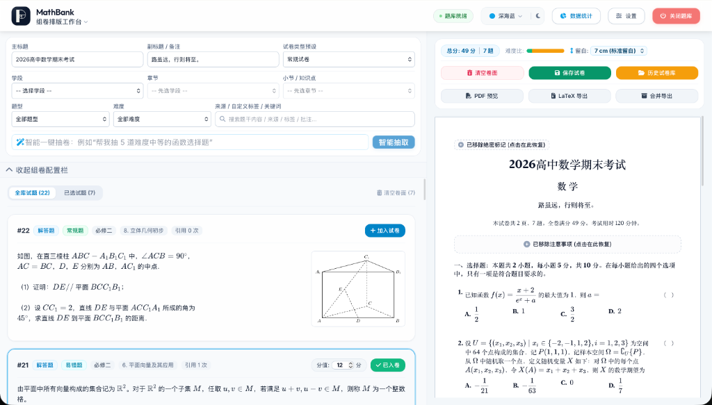

# MathBank - 本地化数学题库与组卷排版工作台

> 🏷️ **项目标签**：数学题库 | 高中数学 | 备课教研 | A4 Live Preview | 智能组卷 | XeLaTeX 排版 | TikZ 几何绘图 | LaTeX 公式 | OCR 公式识别 | DeepSeek AI | 教育技术 (EdTech)

🎉 **MathBank** 是一个专为中学数学教师打造的、完全本地化运行的轻量级半自动化数学题库与组卷排版工作台。

本项目追求**极简配置**、**零前端构建**与**极致本地体验**，开箱即用。内置 LaTeX 公式与 TikZ 几何图形秒级渲染引擎，深度集成组卷排版工作台、A4 Live Preview 仿真画布、高考级 XeLaTeX 编译导出，以及主流大语言模型（DeepSeek / 阿里百炼 / GPT / Claude 等）与多通道 OCR 接口。




---

## 🎯 项目亮点与设计定位

MathBank 源于一线高中数学教研与备课实战，具有鲜明的实用与教研特色：

- 📑 **全流程组卷排版工作台**：实现从「题目精细研讨」到「试卷排版组装」的双工作台无缝切换。提供 A4 Live Preview 仿真画布，支持密封线、注意事项、双向 WYSIWYG 标题编辑、解答题留白调控与 A3 答题卡 / 高考 19 题预设。
- 🖨️ **高考级 XeLaTeX 编译与 0ms 缓存**：内置完整 `exam-zh` 高考排版宏包及依赖，支持一键导出高清 PDF 与完整 XeLaTeX 源码包 (.zip)。内置 MD5 哈希与插图时间戳 LRU 内存缓存，相同试卷 0ms 瞬间复用。
- 🤖 **AI 智能组卷与教学理推理**：依托核心解题大模型，融入中学数学教学思维（双向细目表、知识点覆盖率与难度阶梯分布），一键智能挑选最适配的试卷组合。
- 📚 **多教材大纲预设与无感迁移**：原生内置 **人教A版**、**人教B版** 与 **苏教版** 大纲。切换大纲时系统自动执行增量对齐，实现多套大纲大范围无感迁移与身份共存。
- 🔍 **精细化教研与自定义维度**：支持「易错题」、「常规题」、「挑战题」、「强基题」四档难度及免代码 JSON 维度配置，配合自定义 Tag 徽章与双向关联题组（变式题/子母题）管理。
---

## 🛠️ 快速开始

> [!TIP]
> **📄 PDF 试卷拆解导入建议**：导入试卷 PDF 时，建议优先选用**仅含题干（无冗长解析）**的短试卷。详细解析推荐在题目拆解入库后，使用系统内置的 AI 一键推导或手动补充，避免因原文件文本过多导致大模型上下文 Token 超限。

> [!TIP]
> **📦 便携包推荐（非技术/懒人用户首选）**
> 如果您不熟悉 Git、Python 或命令行操作，可以直接前往 [**Releases 页面**](https://github.com/JudgePeach/math-question-bank/releases) 下载我们打包好的双平台便携包，解压即用：
> * **💻 Windows 用户**：下载 `MathBank-Windows-x64.zip`，解压后双击 **`启动题库系统.bat`** 即可运行（包内已完整内置便携式 Python 运行环境）。
> * **🍏 macOS 用户**：下载 `MathBank-macOS.zip`，解压后双击 **`启动题库系统.command`** 即可运行（首次启动时会自动在本地创建虚拟环境并初始化依赖）。
>
> ⚠️ **关于 API 密钥的获取与配置**：
> 无论是使用源码还是便携包，AI 智能解析与 OCR 公式识别均依赖外部 API。请先前往以下平台注册并申请相应的 API 密钥，在启动项目后，点击网页右上角的 **设置（齿轮）按钮** 即可一键填入并保存：
> * **🤖 AI 推理大模型**：请注册并获取密钥于 [DeepSeek 开放平台](https://platform.deepseek.com/)
> * **📷 OCR 公式识别（首选通道）**：请通过专属 [硅基流动 (SiliconFlow) 邀请链接](https://cloud.siliconflow.cn/i/hkgjSWrg) 注册并获取密钥 (模型推荐使用 `Qwen/Qwen3-VL-8B-Instruct`，正常够用了；也可以选择 `Qwen/Qwen3-VL-32B-Instruct`，双倍价格但效果更好)
> * 关于中转站：下面两个都是自用的，各有优势，谨慎使用。
> * **🔗 推荐多模态中转站 A (适合 GPT 模型)**：通过专属 [RightCodes 注册链接](https://www.right.codes/register?aff=f7656b31) 获取 API Key。该中转站提供价格实惠且性能优越的 gpt-5.5 (gpt-4o) 系列模型，极其适合作为高级 TikZ 绘图模型 (`PREFER_DRAW_MODEL`) 进行多模态图形分析与矢量几何插图重建。
> * **🔗 推荐多模态中转站 B (适合 Claude 模型)**：通过专属 [PackyAPI 注册链接](https://www.packyapi.com/register?aff=5yyF) 获取 API Key。该中转站对 Anthropic 的 `claude-3-5-sonnet`、`claude-opus-4-8` 等高端模型提供非常优厚的折算，且内置了极其方便的阿里系大模型优惠。
>
> 💡 **关于模型偏好配置 (Preferences)**：您可以在网页端右上角的**设置 (齿轮图标)**中对各项默认模型进行配置，系统将自动写入 `.env`：
> * `PREFER_SOLVE_MODEL` (解答与智能组卷模型)：默认 `deepseek-v4-pro` (支持中转站或 DeepSeek 官方)。
> * `PREFER_PARSE_MODEL` (整卷拆解模型)：默认 `deepseek-v4-flash`。
> * `PREFER_CLASSIFY_MODEL` (题目分类模型)：默认 `deepseek-v4-flash`。
> * `PREFER_DRAW_MODEL` (高级 TikZ 绘图模型)：推荐使用 `ZHONGZHAN_GPT/gpt-5.5`、`ZHONGZHAN_CLAUDE/claude-3-5-sonnet` 或硅基流动 `Qwen/Qwen3-VL-32B-Instruct` 等多模态 VLM，以实现双阶段 OCR 自动多模态重绘。
>
> > [!IMPORTANT]
> > **关于 TikZ 自动几何重绘与本地 LaTeX 编译环境依赖**：
> > 系统的 AI 智能几何插图 TikZ 重绘和 PDF 试卷编译渲染功能，高度依赖您**本地已安装的 LaTeX 编译排版环境**（如 macOS 下的 **MacTeX**，Windows 下的 **TeX Live** 或 **MiKTeX**）。
> > 请确保安装后，您本地的命令行中能正常调用 `pdflatex` 与 `xelatex` 命令（即已正确将 LaTeX 工具链加入系统的环境变量 `PATH`）。如果本地未安装，AI 生成的 TikZ 源码和试卷 LaTeX 源码依旧能够完好保存与导出，但后台编译 PDF 将受到限制。
> >
> > [!NOTE]
> > **🔄 旧版本覆盖升级用户的依赖补装说明（针对 TikZ 图形无法渲染/缺失 pymupdf 报错）**：
> > 本次升级引入了用于 PDF 转图像的 `pymupdf` 核心依赖。如果您在覆盖代码后遇到 `Python 环境中未安装 'pymupdf'` 的报错，可选择以下任一方式解决：
> > * **方式 A（推荐，极速）**：直接在项目根目录下打开终端，运行命令手动补装该库：
> >   - **macOS 用户**：`./venv/bin/pip install pymupdf`
> >   - **Windows 用户**：`venv\Scripts\pip install pymupdf`
> > * **方式 B（清空重装）**：直接物理删除项目根目录下的 **`venv/`** 虚拟环境文件夹，重新双击执行启动脚本（`启动题库系统.command` 或 `启动题库系统.bat`），系统检测到环境缺失后将自动全量且干净地拉取安装最新依赖。

### 源码运行步骤

1. **克隆项目**：
   ```bash
   git clone https://github.com/JudgePeach/math-question-bank.git
   cd math-question-bank
   ```

2. **安装 Python 依赖** (推荐 Python 3.8+)：
   ```bash
   pip install -r requirements.txt
   ```

3. **配置 API 密钥** (二选一)：
   - **方式 A（网页配置，推荐）**：启动项目后点击网页右上角 **设置（齿轮）** 填写并保存。
   - **方式 B（手动配置）**：复制 `.env.example` 为 `.env` 并填入密钥。

4. **启动项目**：
   - **🍏 Mac 用户**：双击 **`启动题库系统.command`**
   - **💻 Windows 用户**：双击 **`启动题库系统.bat`**
   - **⌨️ 命令行启动**：运行 `python -m uvicorn main:app --reload`，然后浏览器访问 `http://127.0.0.1:8000`

---

## 🔄 版本升级与数据备份

### 升级方式

- **方式 A：Git 升级（推荐 ⚡）**
  ```bash
  git pull
  ```
  *说明：数据库 (`*.db`)、API 密钥 (`.env`)、维度配置 (`data_backup/`) 及插图 (`static/uploads/`) 均已被 Git 忽略，执行 `git pull` 绝不会影响本地数据。*

- **方式 B：便携包覆盖更新 ⚠️**
  直接解压新版压缩包，覆盖/合并到现有项目文件夹中。*请勿直接删除原文件夹。*

> [!IMPORTANT]
> **💡 数据备份建议**：升级前建议手动备份以下重要文件/目录：
> - `*.db` (本地题目数据库)
> - `.env` (API 密钥配置)
> - `data_backup/` (自定义维度与章节大纲配置)
> - `static/uploads/` (已上传的插图与几何图形)

---

## 🔍 命令行检索与实用脚本

### 1. 本地终端极速检索 (`search_questions.py`)
在终端中快速检索题库（如搜索“导数”）：
```bash
python3 search_questions.py -q "导数"
```
**主要参数**：`-q` 关键词 | `-n` 返回数量 (默认 50, `-1` 无上限) | `-a` 携带答案解析 | `-t` 题型过滤 | `-d` 难度过滤 | `-r` 关联题目检索

### 2. 数据清洗与自愈脚本
- **填空题下划线全量升级**：`python3 migrate_fillin.py`（将旧下划线规范化为 `\fillin` 宏）
- **选择题题干空括号净化**：`python3 migrate_choice_parentheses.py`（自动抹除题干末尾空括号，防止与 `\paren` 重叠）

---

## 🌟 核心特性

- 🧪 **极简技术栈 & 100% 离线支持**：后端 `Python + FastAPI + SQLite`；前端纯 `HTML + JS`（零构建），Tailwind CSS, FontAwesome, KaTeX 等关键静态资源均已本地化，支持完全离线使用。
- 📑 **组卷排版工作台 & A4 Live Preview**：
  - **双工作台切换**：顶部导航栏一键切换“题库研讨”与“组卷排版”工作台，状态自动持久化。
  - **A4 仿真 Preview**：1:1 仿真 A4 试卷（210mm x 297mm），支持密封线、卷头大标题、副标题与注意事项框。
  - **WYSIWYG 标题编辑**：支持在侧栏或 Live Preview 画布上自由双向实时修改主副标题。
  - **解答题留白调控**：实时渲染留白区并提供快捷内联微调按钮，留白高度随试卷自动存库并与 LaTeX 精确同步。
  - **插图排版位置联动**：插图支持 `right`（题干右侧混排）、`center`（居中）、`bottom_right`（下方居右）灵活切换。
  - **拖拽排序 & 试卷管理**：支持拖拽卡片调整试卷题目顺序，组卷结果存入本地 `papers` 库，支持历史试卷全生命周期管理。
- 🖨️ **高考级 XeLaTeX 编译引擎**：
  - **三大标准模板**：`exam`（常规试卷）、`quiz`（日常小练）、`exam_19`（新高考 19 题专属答题卡联动卷）。
  - **0ms LRU 字节缓存**：基于源码 MD5 与插图时间戳防碰撞校验，重复编译瞬间复用字节流。
  - **零依赖自愈编译**：全量内置 `exam-zh` 宏包及 21 个 helper 依赖库，本地 TeX Live 无需额外安装扩展包。
- 🤖 **AI 智能组卷与多模态教研**：
  - **AI 智能组卷**：结合双向细目表与难度阶梯分布，自动挑选试卷题目组合。
  - **三合一解答工作流**：支持手动录入、AI 智能生成（DeepSeek 步骤推导）、OCR 图像识别（阿里百炼、硅基流动等双通道）。
  - **TikZ 几何重绘 & PDF 拆卷**：识别插图自动触发 VLM 生成 TikZ 代码重绘；支持 PDF 试卷多模态拆解与灯箱拖拽框选高精截图。
- 📚 **多教材大纲预设与自动对齐**：独创“活跃-镜像模式”，不同大纲下的分类记录独立保存，切换大纲时智能自动对齐映射。
- 📐 **LaTeX 排版规范自愈**：
  - **选择题 choices 环境**：统一解析存储为 LaTeX `choices` 环境，前端与 LaTeX 引擎自适应网格排版。
  - **填空题 \fillin 宏**：强置将下划线生成为标准 `\fillin` 宏，KaTeX 默认渲染为 1.5cm 标准下划线。
  - **空括号物理净化**：自动抹除选择题题干末尾全角/半角空括号，彻底规避与 LaTeX 模板 `\paren` 重叠。
- 📂 **存储空间自动净化**：编辑/删除题目自动物理删除废弃图片，启动服务后台自动清理超 1 小时的孤儿临时文件。
- 🔒 **AI 专属只读题库 & CLI 检索**：后台写操作自动生成 `data_backup/questions_library.md`（彻底过滤答案与解析，防止 AI 泄露）；提供 CLI 检索工具 `search_questions.py`。

---

## 🧪 单元测试

项目配备隔离的 Pytest 单元测试（使用内存 SQLite 数据库，不污染本地数据）：
```bash
PYTHONPATH=. pytest tests/
```

---

## 📂 项目目录结构

```text
.
├── data_backup/                # 实时备份与 AI 专属只读题库 (已忽略)
│   ├── questions_backup.json   # 完整数据库 JSON 备份
│   └── questions_library.md    # AI 专属只读题库（过滤答案，防 AI 泄露）
├── static/                     # 前端静态资源目录
│   ├── index.html              # 主控制台前端页面 (SPA)
│   ├── css/                    # Tailwind, FontAwesome, KaTeX 离线样式
│   ├── uploads/                # 插图存储目录 (自动物理清理)
│   └── js/                     # 级联加载前端 JS 模块
│       ├── api.js              # API 交互与 Token 拦截
│       ├── editor.js           # 编辑、KaTeX 预览与 TikZ 编译
│       ├── ocr.js              # OCR 公式识别与交互
│       ├── import.js           # 试题拆解与草稿/题库列表
│       └── paper.js            # 组卷排版工作台 & Live Preview 渲染引擎
├── templates/                  # LaTeX 试卷模板与 exam-zh 宏包库
├── tests/                      # Pytest 单元测试目录 (内存数据库)
├── database.py                 # SQLite 数据库模型 (SQLAlchemy)
├── main.py                     # FastAPI 服务主入口与路由逻辑
├── paper_helper.py             # 组卷逻辑、LaTeX/PDF 编译引擎与 LRU 缓存
├── sync_helper.py              # 数据同步、备份锁与 AI 题库清洗
├── search_questions.py         # 本地终端 SQL 极速模糊检索 CLI 工具
├── migrate_fillin.py           # 填空题 \fillin 宏升级工具
├── migrate_choice_parentheses.py # 选择题空括号清理工具
├── build_release.py            # 跨平台一键打包 Release 脚本
├── 启动题库系统.bat            # Windows 一键启动脚本
├── 启动题库系统.command        # macOS 一键启动脚本
├── requirements.txt            # Python 依赖包清单
└── .env.example                # 环境变量配置模板
```

---

## 📄 开源协议

本项目采用 [GNU AGPLv3](LICENSE) 协议开源。
