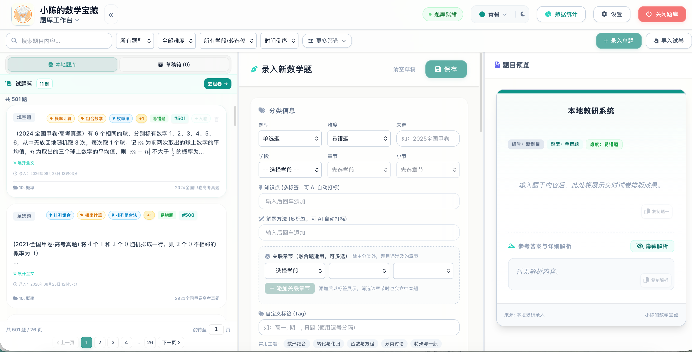
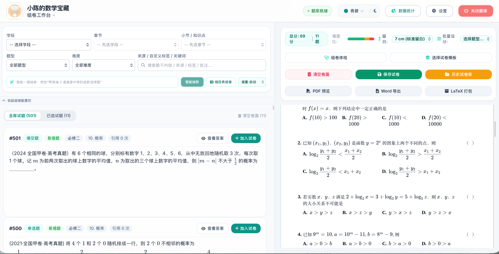
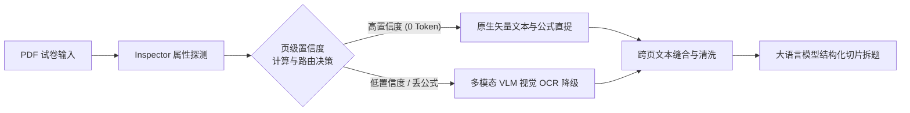
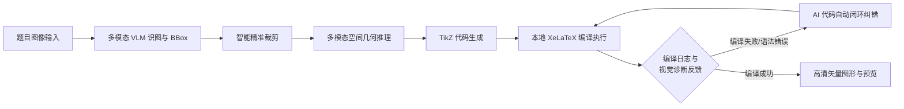

# 小陈的数学宝藏


> 数学题库 · 高中数学 · 备课教研 · A4 仿真排版 · 智能组卷 · 高考级导出 · OCR 识题 · DeepSeek AI
>
> 派生于 [`JudgePeach/math-question-bank`](https://github.com/JudgePeach/math-question-bank)，沿用 **GNU AGPLv3**。详见[项目渊源与致谢](#项目渊源与致谢)。

**小陈的数学宝藏** 是给中学数学老师用的本地题库与组卷备课工具，数据全在自己电脑上，无需联网。在原项目（MathBank）基础上，针对"个人备课"做了二次开发：题库 / 组卷双工作台、受控标签、统一难度、拆卷进度可视化等。

无需前端编译：Windows 与 macOS 便携包都自带 Python 运行时，解压双击即跑，不需要先装 Python 或联网装依赖。支持公式与几何图形秒级预览，内置一键组卷、A4 仿真排版、高考级 PDF 导出、DeepSeek 解题与 OCR 识题。





---

## 项目渊源与致谢

本项目是 [`JudgePeach/math-question-bank`](https://github.com/JudgePeach/math-question-bank)（原名 MathBank）的派生版：

- **原作者**：[JudgePeach](https://github.com/JudgePeach)，全部底层能力（FastAPI、PDF/Word/LaTeX 拆卷、A4 排版、AI 工作流等）均源自该仓库，特此致谢。
- **协议**：沿用 **GNU AGPLv3**，保留原 LICENSE 与版权声明。依 AGPLv3，任何分发（含联网服务）都须提供完整源码——本仓库即满足。
- **与原项目关系**：保留核心架构与协议，在其上做"个人备课"向的二次开发（见[相比原项目的变动](#相比原项目的变动)）。本派生作为**独立仓库**维护，不再跟踪上游更新。

> 原项目：<https://github.com/JudgePeach/math-question-bank>

> [!IMPORTANT]
> **数据库 schema 为本派生私有版本（v4），与上游不兼容。** 本仓库内置迁移仅覆盖 v1→v4（本派生内部演进），不会、也不能把上游 MathBank 的数据库直接迁移过来。请勿将上游 `mathbank.db` 与本派生混用或互相覆盖；如需引入上游题目，请走"题目导出 / 重新导入"链路，而非直接替换数据库文件。相关逻辑见 `mathbank/db_migrations.py`。

---

## 相比原项目的变动

以下为本派生版新增 / 修改的能力（其余继承自原项目）：

**导入与拆解**

- 多文件队列批量导入：多份 PDF / Word / TeX 一次入队，逐份串行拆解、按来源分组、支持人工逐份审核；含已导入免重复拆解、队列自愈、部分完成即可导入等健壮性增强。
- 文档分块拆题 + 单题 OCR 自动分流：超长文档按题号切分逐块解析，根治超长截断；长文档自动分块、单题智能选 OCR 通道。
- OCR 后自动全量分类：识别后 AI 自动填好 8 个分类字段并覆盖写入，免去手动保存。
- 原卷预览放大：拆解页"查看原文件"升级到 250 DPI，缩放范围 0.2–5.0，便于逐题核对题图。
- 导入题号 / 出处清洗：各入库路径防御性剥离题干开头的残留原卷题号，`source` 默认填来源文件名便于溯源。
- 拆卷步骤进度条 + 错误定位：拆卷过程进度可见，出错时高亮失败步骤。

**标签与难度治理**

- 受控词表防标签混乱：新增 `tag_vocabulary.json`（知识点 422 规范名 + 64 别名，解题方法 70 + 7 别名），所有写入路径落库即归一——`函数的单调性` 自动折叠为 `函数单调性`，从源头杜绝标签碎片化。
- 难度枚举统一：抽出 `DIFFICULTY_VALUES` 作全链路唯一事实来源（易错 / 常规 / 挑战 / 强基四档），新增 `normalize_difficulty()`，AI 不再把常规题误判为易错。
- 题目多标签 + 题库多选筛选：新增 `knowledge_list` / `solve_method` 两列，AI 打标 + 手改；题库支持知识点 / 解题方法搜索式多选筛选。
- 关联章节多章节归属：一道题可归多个章节，录入 / 导入 / 分类 UI 均已支持。

**题目来源治理**

- 来源命名规整：新增 `mathbank/source_normalize.py`（`CANONICAL_MAP` + `normalize_source()`），把题库里 67 种混乱写法（裸写式高考真题、原始文件名、学校别名等）归一到统一模板，全库 995 题去重来源 67→60 种、空值清零。2026-09-10 扩为六类规约并回溯全库：1312 题 / 95 种来源 → 88 种，**合规率 100%**（原 36%）。

  命名规约：

  | 类别 | 模板 |
  |---|---|
  | 校内考试 | `{学段} · {考试类型} · {学校} · {学年}` |
  | 高考真题 | `{年份} · {卷种} · 高考真题` |
  | 模拟 | `{年份} · {地区} · 模拟` |
  | 联考 | `{年份} · {考试名} · 联考` |
  | 专题汇编 | `高考 · 专题汇编 · {专题}` |
  | 教辅自编 | `教辅 · {名称}` |

  分隔符统一用两侧带空格的 ` · `，**高考真题是唯一例外**：库内已有大量无空格写法（35 种 / 559 题），两种形式均视为合规，归一函数原样返回——否则同一份卷会裂成两条来源。
- 落库实时钩子：后端 `create_question` / `update_question` / AI·OCR 导入 / PDF·DOCX 拆卷五处写 `source` 前自动 `normalize_source()`；新增 `GET /api/source-canonical-map` 把映射表吐给前端。
- 前端预览对齐：单题录入 `editSource` 失焦即实时归一，OCR 自动继承来源也归一，预览值 = 存储值，从源头杜绝再次混乱。

**AI 成本优化**

- 免费模型自动路由：新增 `free_model_routing.py`，先免费模型评估难度，简单 / 中等走免费，困难 / 超长 / Key 缺失安全回退付费，省钱不降质。

**组卷工作台**

- 备课场景增强：重写 `paper.js`（+974 行），围绕"选题 → 组卷 → 体检 → 保存 → 导出"做增强，含全部试题虚拟滚动、答案弹窗、公式渲染修复、批量加入试卷等。

**公式、文档与导出**

- 公式锁（MBM）强化与放宽并行：导入 / 导出锁定公式原位；同时放宽 `restore(strict=False)` 提升容错。
- docx 拆卷增强：管线升级到 250 DPI，新增 MathType 乱码清洗。
- Word 导出优化：解析图 PNG 兜底去边框 + 等比，避免误入学生版试卷。

**前端体验与稳定性**

- 前端视觉优化：6 套主题色（珊瑚橘默认 / 靛青 / 青碧 / 洋红 / 藏青 / 天空），手绘橙子羽毛球 Logo，favicon 内联绕过 Safari 缓存，玻璃拟态精修。（一些羽球人的小心思hhh）
- 选择题选项归一化：新增 `latex_normalize.py`，把 `A. B. C. D.` 规整为 exam-zh `choices` 环境，幂等可重复。
- TikZ 入口隐藏：前端移除易误触的 TikZ 入口（后端保留并做空值保护）。
- 多项体验 bug 修复：保存后误弹未保存提示、组卷 tab 切换空白、标签串题、多文件队列卡死、favicon 缓存等。

**测试与工具**

- 新增 `tests/` 回归用例与 `tools/` 验证脚本，覆盖难度、标签、多文件队列、关联章节、OCR 分类、免费路由、虚拟滚动等核心改动。

**已知 TODO**

- 讲义（handout）功能：从题库 / 组卷走向备课的关键一环，规划中、未实现。
- 受控词表前端联想（第 3 层）+ 周期复检工具：当前归一在后端生效，计划补"只选已有"联想下拉与 `tools/tag_audit.py` 复检。（其实主要是解决手输标签可能会更加杂乱的问题）

---

## 核心亮点

只需懂点 LaTeX 基础语法，就能高效搞定组卷：

- **1:1 A4 仿真排版**：像 Word 一样的仿真试卷画布，密封线、大标题、注意事项框齐备；支持拖拽排序、留白调整、一键切 A3 答题卡与高考 19 题预设。
- **秒级公式渲染 + 高考级导出**：改完网页即时预览，一键导出高考标准高清 PDF 与完整排版源码包。
- **AI 智能组卷与解答**：内置 DeepSeek 等大模型，按考点细目表与难度阶梯一键选卷；单题一键生成解析与教学反思。
- **主流教材大纲一键切换**：预设人教 A / B 版、苏教、沪教四套大纲，切换时自动智能映射，无需手动重排。
- **多格式拆解 + PDF 双策略**：直接拖入 .tex / .pdf / .docx 切片拆题。PDF 默认【原生文字公式提取】（0 Token 损耗极速），遇公式转图自动降级 VLM 视觉 OCR 补全，另有全图 OCR 备选，保障 100% 拆解。Word 导入结构化转换 OMML 并解析 MathType。
- **多份试卷队列式批量拆解**：多份一次入队、按来源分组、逐份串行 + 人工审核。
- **免费 / 付费模型自动路由**：先免费模型评估难度，复杂 / 超长 / 异常自动回退付费，省开销不降质。

---

## AI Agent 工作流

内置多套自动容错、可自愈的 AI 工作流，保障拆解、绘图与并发解题的可靠性：

### 1. PDF 解析



### 2. 几何图形重构与自愈



### 3. 试卷切片与并发解题


---

## 使用前提与环境

- **LaTeX 依赖**：只有用到 **TikZ 几何重绘** 或 **一键导出 PDF** 时才需要本地 LaTeX。仅录入、预览、检索、AI 解答、导出源码则完全不需要。需要的话：
  - macOS：装 [MacTeX](https://www.tug.org/mactex/)（约 5GB，国内用[清华镜像](https://mirrors.tuna.tsinghua.edu.cn/CTAN/systems/mac/mactex/)）
  - Windows：装 [TeX Live](https://www.tug.org/texlive/)（[清华镜像](https://mirrors.tuna.tsinghua.edu.cn/CTAN/systems/texlive/Images/)），也可选 MiKTeX
- **Word (.docx) 安全导入**：无需装 Word / MathType。系统转换常见 OMML 公式、解析 MathType 结构，递归保留超链接 / 修订 / 表格 / 原图；不能高置信转换的公式保留预览图并标记人工核对。

---

## 快速开始

> [!TIP]  
> **完全不懂命令行？** 复制 [`一键安装指令.md`](一键安装指令.md) 里的那段话，粘贴给能操作你电脑的 AI 助手（WorkBuddy 等），它会自动完成「下载 → 装环境 → 装依赖 → 启动」，你全程不用敲命令。
>
> 想自己动手，走下面两个方式。

> [!IMPORTANT]  
> **首次运行前，先配置你自己的 API Key**（程序不内置、不代填）：
>
> 1. 启动后点网页右上角 **⚙️ 设置**；
> 2. 在「API 配置」填入你自己的 DeepSeek / 阿里百炼 / 硅基流动等密钥并保存。
>
> 没配 Key 时，**基础功能仍可用**（录入、预览、检索、导出源码）；但 **AI 拆解 / 解题 / OCR** 需要有效 Key。各平台免费领取方式与选型见[API 配置指南](#api-配置与大模型选型指南)。

### 方式一：下载便携包（非技术用户首选）

到 [Releases](https://github.com/ccccsssssyyyyyy/xiaochen-math-treasure/releases/latest) 下载对应系统的包，**完整解压到普通文件夹**后双击启动器：

| 平台 | 下载文件 | 启动方式 |
|---|---|---|
| Windows | `MathBank-Windows-x64.zip` | 自带 Python，解压后双击 `启动题库系统.bat` |
| macOS（Apple 芯片 M1/M2/M3/M4） | `MathBank-macOS-AppleSilicon.zip` | 自带 Python，解压后双击 `启动题库系统.command` |
| macOS（Intel 芯片） | `MathBank-macOS-Intel.zip` | 自带 Python，解压后双击 `启动题库系统.command` |

**不确定 Mac 是哪种芯片**：左上角  →「关于本机」看「芯片」一行——写着 Apple M* 就下 AppleSilicon 版，写着 Intel 就下 Intel 版。下错了启动器会直接提示该换哪个包，不会静默失败。

两个平台包都**自带 Python 运行时**，解压双击即跑，不需要先装 Python、也不会联网装依赖。两个启动器只会停掉本项目记录的旧服务；端口 8000 被占用会安全退出，健康检查失败不自动开浏览器。

> 只有**改过代码、要自己打包**时才用 `python3 -m scripts.build_release`（构建器校验运行时哈希与白名单），产物只保存在本地 `dist/`，不会上传。

### 方式二：源码运行

1. **获取项目**：
   ```bash
   git clone https://github.com/ccccsssssyyyyyy/xiaochen-math-treasure.git
   cd xiaochen-math-treasure
   ```
2. **装依赖**（Python 3.10+）：
   ```bash
   python -m pip install -r requirements.txt
   ```
   参与开发 / 测试用 `python -m pip install -r requirements-dev.txt`。版本已锁定，升级时请跑测试与 `python -m pip check`。
3. **启动**：
   - Mac：双击 `启动题库系统.command`
   - Windows：双击 `启动题库系统.bat`
   - 命令行：`python -m uvicorn main:app --reload`，浏览器开 `http://127.0.0.1:8000`

> [!NOTE]  
> **Windows 源码运行要点**
> - 需先装 **Python 3.10+**（安装时勾选 Add to PATH）。双击 `启动题库系统.bat` 会自动建 `venv` 并装依赖；也可手动：`python -m venv venv` → `venv\Scripts\activate` → `pip install -r requirements.txt` → `python main.py`。
> - **不要**把 macOS 上的 `venv/` 拷到 Windows——虚拟环境含平台专属二进制，必须在本机重建。
> - 用到 **Word 导入 / TikZ 公式图 / PDF 导出** 时，请装好 **LibreOffice**、**TeX Live**（或 MiKTeX）、**Pandoc** 并加入 PATH。程序已内置 Windows 默认安装路径自动探测（LibreOffice 默认 `C:\Program Files\LibreOffice\program\`、TeX Live 默认 `C:\texlive\<年>\bin\windows`），按默认路径安装即可免配；若自定义安装，请手动把其 `bin` 目录加入 PATH。

> [!TIP]  
> **拆解建议**
>
> 1. **PDF 策略**：保持默认【原生文字公式提取】即可极速切片；遇图公式丢公式会自动 VLM OCR 补全；极特殊扫描卷可手动切【全图视觉 OCR】。
> 2. **内容建议**：无论 PDF 还是 Word，优先选**仅含题干（无冗长解析）**&#x7684;卷，避免超出模型 Token 上限。

---

## API 配置与大模型选型

无论源码还是便携包，AI 解析与 OCR 都依赖外部 API。启动后点右上角 **设置（齿轮）** 一键填密钥即可。

### 1. 纯文本推理大模型（解题 / 拆卷 / 分类）

推荐 [DeepSeek 官方平台](https://platform.deepseek.com/) 密钥，性价比与推理强。

### 2. 公式识图 OCR（必须用多模态 VLM）

- **必须用多模态模型**：识图要读图像，DeepSeek 纯文本模型干不了 OCR。
- **国内模型**：推荐通义千问 (Qwen-VL) 或 MIMO 系列。可在 [硅基流动](https://cloud.siliconflow.cn/) 注册（实名可领代金券），或去 [阿里云百炼](https://bailian.console.aliyun.com/)（3 个月免费额度）。硅基流动用 `Qwen/Qwen3-VL-8B-Instruct`；阿里百炼常规 OCR / 拆卷 / 分类用 `qwen3.7-flash`，解答与绘图用 `qwen3.7-plus`。
- **海外 / 中转站**：有渠道的话**强烈推荐 `GPT-5.6 Luna`**——近期大幅降价，公式提取与精度超多数模型，成本甚至低于千问，是识图首选。

### 3. TikZ 几何绘图模型（`PREFER_DRAW_MODEL`）

- 开启双阶段几何重绘时，**别用国内模型**（TikZ 代码生成普遍偏弱）。
- 选 **GPT 系列**（如 `GPT-5.6 Luna`）或 **Gemini 系列**（如 `Gemini 3.6 Flash`），矢量还原度高。

> [!WARNING]  
> **第三方中转站声明**  
> 下方两个中转站链接仅因开发者日常在用，**不对其稳定性、模型真实度或数据隐私作任何担保**。中转站可能存在泄露、掺水、换模型等风险，请谨慎评估：
>
> - **中转站 A（GPT 系）**：[RightCodes](https://www.rightapi.ai/)，实惠的 `gpt-5.6-luna` 系列。
> - **中转站 B（Claude / 阿里系）**：[PackyAPI](https://www.packyapi.com/)。

> [!IMPORTANT]  
> **TikZ 重绘与 LaTeX 依赖**  
> AI 几何插图 TikZ 重绘、PDF 编译渲染都依赖本地 LaTeX（macOS 用 MacTeX，Windows 用 TeX Live / MiKTeX）。装好后命令行能调 `pdflatex` / `xelatex` 即可。没装也能保存导出源码，只是后台编译 PDF 受限。

---

## 版本升级与数据备份

### 升级方式

- **界面一键更新**：右上角【设置】→【版本更新】，实时比对 GitHub Release，可一键下载对应便携包，也支持忽略不常更的版本。
- **方式 A：Git 升级**（源码用户）
  ```bash
  git pull
  ```
  `*.db`、`.env`、`data_backup/`、`static/uploads/` 均被 Git 忽略，`git pull` 不动本地数据。
- **方式 B：便携包覆盖**
  1. 先建一份完整备份（见下）。
  2. 右上角电源按钮安全关服务，等提示已停止，别在运行时覆盖。
  3. 新版 ZIP 解到临时目录，不要直接解进原目录。
  4. Windows：打开新版文件夹，全选内容复制到原目录并替换同名文件。
  5. macOS Finder：先 `Cmd+Shift+.` 显示隐藏文件，再复制新版全部内容到原目录合并；**别选"替换整个文件夹"**，否则可能误删本地数据。
  6. 双击新版启动器，它会校验 Release 文件并只清理该删的旧文件；覆盖升级保留数据库、`.env`、`data_backup/`、`static/uploads/` 等。

> [!IMPORTANT]  
> **备份建议**：覆盖升级前先完整备份：`*.db`、`.env`、`data_backup/`、`static/uploads/`。

---

## 命令行检索与实用脚本

### 1. 终端检索 (`scripts/search_questions.py`)

```bash
python3 -m scripts.search_questions -q "导数"
```

参数：`-q` 关键词 | `-n` 数量(默认 50, `-1` 无限) | `-a` 带解析 | `-t` 题型 | `-d` 难度 | `-r` 关联检索

### 2. 数据清洗与构建

- 填空题下划线升级：`python3 -m scripts.migrate_fillin`
- 选择题空括号净化：`python3 -m scripts.migrate_choice_parentheses`
- 构建 Release：先确认 `mathbank/__init__.py` 版本号，再 `python3 -m scripts.build_release`（校验运行时哈希、白名单、源码 smoke，生成清单与 .sha256）

### 3. 备份与恢复

```bash
python3 -m scripts.backup                            # 建完整备份（库+图+配置）
python3 -m scripts.restore <快照.zip>                # 只校验
python3 -m scripts.restore <快照.zip> --apply --yes  # 实际恢复（须先关服务）
```

备份含逐文件 SHA-256 清单，不含 `.env` 与密钥；与恢复工具共用运行锁，服务未关时拒绝恢复。`questions_backup.json` 只是 JSON 导出，不能代替完整备份。

---

## 项目目录结构

```text
.
├── data_backup/                # 实时备份与 AI 专属只读题库 (已忽略)
│   ├── archive/                # 历史迁移与测试数据库归档
│   ├── snapshots/              # 带清单与哈希校验的完整恢复包
│   ├── schema_snapshots/       # 数据库迁移前独立快照及 SHA-256
│   ├── questions_backup.json   # 题目 JSON 同步导出（非完整恢复包）
│   └── questions_library.md    # AI 专属只读题库（过滤答案，防 AI 泄露）
├── docs/                       # 项目文档与 README 展示图片
│   ├── AI_DATABASE_GUIDE.md    # AI 题库检索使用指南
│   ├── 项目目录重构与模块解耦整理计划.md
│   └── images/                 # 产品界面预览图
├── mathbank/                   # 后端业务领域包
│   ├── database.py             # SQLite 数据模型与 Session
│   ├── db_migrations.py        # 版本化、备份优先的 SQLite 迁移
│   ├── backup.py               # 完整备份、验证、恢复与回滚
│   ├── asset_security.py       # 上传验证与本地资产路径安全边界
│   ├── task_manager.py         # 有界异步任务、取消与资源生命周期
│   ├── health.py               # 启动就绪与数据库健康检查
│   ├── paper_helper.py         # LaTeX/PDF 编译、排版与 LRU 缓存
│   ├── sync_helper.py          # JSON 同步导出与 AI 题库清洗
│   ├── paths.py                # 与工作目录无关的项目路径单一来源
│   ├── curriculums.py          # 四套教材预设、默认元数据、难度唯一事实来源、受控词表
│   ├── prompts.py              # OCR/解题/拆卷/TikZ/组卷提示构建器
│   ├── ai_providers.py         # AI Provider 与模型参数解析
│   ├── ai_http.py              # AI HTTP 请求与鉴权
│   ├── ai_json.py              # AI 结构化 JSON 容错解析
│   ├── latex_diagnostics.py    # XeLaTeX 错误定位、本地解释与 AI 诊断合并
│   ├── content_locks.py        # Word 公式原位锁定（MBM 公式锁）、原文恢复与校验
│   ├── omml_helper.py          # Office OMML 结构化公式转换器
│   ├── mtef_helper.py          # MathType OLE/MTEF v5 结构解析与诊断
│   ├── docx_helper.py          # Word 文字/表格/图片安全提取与诊断报告
│   ├── pdf_inspector_helper.py # PDF Inspector 原生矢量直提与双轨探测
│   ├── paper_chunking.py       # 超长文档分块拆题（本派生新增）
│   ├── free_model_routing.py   # 免费模型自动路由（本派生新增）
│   ├── latex_normalize.py      # 选择题选项归一化（本派生新增）
│   ├── source_normalize.py     # 题目来源命名归一化（本派生新增）
│   └── resources/
│       ├── curriculums/        # A/B/S/H 四套共享 JSON 大纲
│       └── tag_vocabulary.json # 知识点/解题方法受控词表（本派生新增）
├── scripts/                    # 运维、迁移、检索与 Release 工具
│   ├── search_questions.py
│   ├── backup.py
│   ├── restore.py
│   ├── migrate_fillin.py
│   ├── migrate_choice_parentheses.py
│   └── build_release.py
├── static/                     # 前端静态资源目录
│   ├── index.html              # 主控制台前端页面 (SPA)
│   ├── css/                    # Tailwind, FontAwesome, KaTeX 离线样式
│   ├── uploads/                # 插图存储目录 (自动物理清理)
│   └── js/                     # 级联加载前端 JS 模块
│       ├── api.js              # API 交互与 Token 拦截
│       ├── editor.js           # 编辑、KaTeX 预览与 TikZ 编译
│       ├── ocr.js              # OCR 公式识别与交互
│       ├── import.js           # 试题拆解与草稿/题库列表
│       └── paper.js            # 组卷排版工作台 & Live Preview 渲染引擎
├── templates/                  # LaTeX 试卷模板与 exam-zh 宏包库
├── tests/                      # Pytest 自动化测试与 artifacts（含本派生回归用例）
├── tools/                      # 轻量验证脚本（如 difficulty_vocab_test.py / tag_vocab_test.py）
├── main.py                     # FastAPI 服务主入口与路由逻辑
├── math_question_bank.db       # 本地 SQLite 主数据库（根目录兼容保留，已被 .gitignore 忽略）
├── 启动题库系统.bat            # Windows 一键启动脚本
├── 启动题库系统.command        # macOS 一键启动脚本
├── README.md                   # 中文说明文档
├── requirements.txt            # Python 依赖包清单
├── requirements-dev.txt        # 开发与测试依赖
└── .env.example                # 环境变量配置模板
```

> [!NOTE]  
> **发布前建议**：上游 `tests/` 已保留，本派生核心改动附 `tools/` 回归脚本。首次发布前跑一遍 `pytest tests/` 与 `python -m pytest tools/` 确认无回归。

---

## 开源协议

采用 [GNU AGPLv3](LICENSE)，继承原项目同款协议。任何分发（含联网服务）都须提供完整对应源码。

版权：Copyright (C) 2026 小陈。原始项目 MathBank 版权归 [JudgePeach](https://github.com/JudgePeach) 所有；本项目为其派生作品，依 AGPLv3 发布，原始版权声明与协议全文完整保留。

---

## 致谢

- 感谢 [JudgePeach](https://github.com/JudgePeach) 开源 [math-question-bank](https://github.com/JudgePeach/math-question-bank)（MathBank），本项目底层能力全部源自该仓库。
- 感谢各 AI 模型方（DeepSeek、通义千问、GPT / Gemini 等）与 LaTeX 生态（TeX Live / MacTeX / XeLaTeX / TikZ）让本地化数学备课成为可能。

---

## 演示图与题目数据

README 中的界面截图（`docs/images/Clipboard_Screenshot*.png`）来自本工具在用户本地题库上的真实渲染效果，仅用于展示工作台功能。截图中的题目片段与学校名称**均来自本项目作者的个人备课数据**，开源版仓库本身**不包含任何题目数据**（数据库已被 `.gitignore` 忽略）；演示图不构成对相关学校或试卷来源的代理或认可。

---

## 第三方依赖致谢

本项目前端通过 `static/lib/` vendored 了若干第三方库与字体，以实现离线运行（无需 CDN）。完整列表与许可证类型见 [``static/lib/THIRD_PARTY_LICENSES.md`](static/lib/THIRD_PARTY_LICENSES.md)。Python 依赖（`requirements.txt`）通过 PyPI 安装。

其中 **PyMuPDF 1.28+（Python 绑定）** 采用 **GNU AGPL-3.0**，与本项目协议兼容，按其许可证要求归属。

Font Awesome 6 的图标采用 **CC BY 4.0**，使用中已保留「Font Awesome by Fonticons, Inc.」署名；如您在自己的派生中移除 Font Awesome，请相应删除本项目 README 中的对应署名并替换为自己的图标方案。

---

## 开源部署（fork 后首次发布）

如您计划将本派生发布到**自有** GitHub 仓库（请勿直接 push 到 `JudgePeach/math-question-bank`），操作清单：

1. **创建自有仓库**（建议设为 `Private`，调试就绪后再转 `Public`）：在 GitHub 创建一个空仓库，**不要**勾选「Initialize with README」（本仓库已有）。
2. **改 remote 指向**：
   ```bash
   git remote set-url origin https://github.com/<your-name>/<your-repo>.git
   git remote -v   # 确认 origin 已切换
   ```
3. **首次 push**：
   ```bash
   git push -u origin main
   ```
4. **AGPL-3.0 合规提醒**（仅当您将本工具部署为**对他人开放的公共服务**时触发）：
   - AGPL-3.0 §13 要求「网络部署须向使用者提供完整对应源码」。本项目定位为本地单机工具（端口 8000、单用户），§13 一般**不触发**；
   - 若您确需提供公共服务部署，应在服务页面给出源码获取链接（指向您的公开仓库）。
5. **个人化数据归属**：
   - 您的真实题库数据库与上传文件均已被 `.gitignore` 忽略，**不会**被 push；
   - 个人题库的来源映射（学校、考试名等）放在 `data/source_canonical_map.json`（已在 `.gitignore` 内），按 `source_canonical_map.example.json` 模板填入；
   - API 密钥放在未跟踪的 `.env`（600 权限）。

如您希望本派生长期保持与上游 `JudgePeach/math-question-bank` 的同步，建议保留现有 `JudgePeach/math-question-bank` 作为第二个 remote（`upstream`），仅拉取不推送：
```bash
git remote add upstream https://github.com/JudgePeach/math-question-bank.git
git fetch upstream
git merge upstream/main   # 手动整合上游更新
```

---

## 致开发者

如您基于本派生继续开发，欢迎把改进回推上游 `JudgePeach/math-question-bank`（原始作者维护），或在自己的 fork 中独立演进。本项目的 4 块核心定制（拆卷进度条、AI 自动归一、选择题选项包裹、来源命名规约）均设计为可移植到上游，亦欢迎上游集成。
